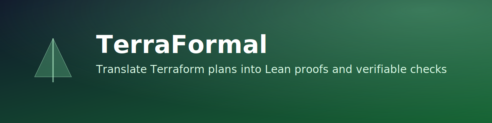

# TerraFormal

TerraFormal is a Haskell tool that parses Terraform plan JSON and generates Lean code to support formal verification workflows.

## Highlights
- Parses Terraform resources from plan output.
- Generates Lean declarations for infrastructure resources.
- Enables proof driven validation workflows for IaC.

## Tech Stack
- Haskell
- Stack
- Lean output generation

## Build
```bash
stack build
```

## Usage
```bash
stack run <plan.json> <output.lean>
```

Example:
```bash
stack run terraform-plan.json output.lean
```

## Project Layout
- `src/Parser.hs` reads and interprets Terraform plan JSON.
- `src/CodeGen.hs` converts parsed resources into Lean code.
- `app/Main.hs` CLI entrypoint.
